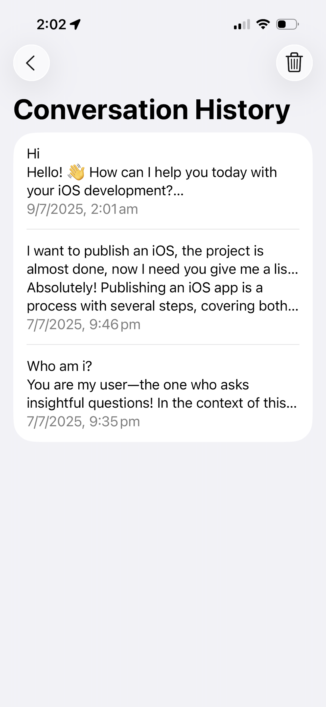
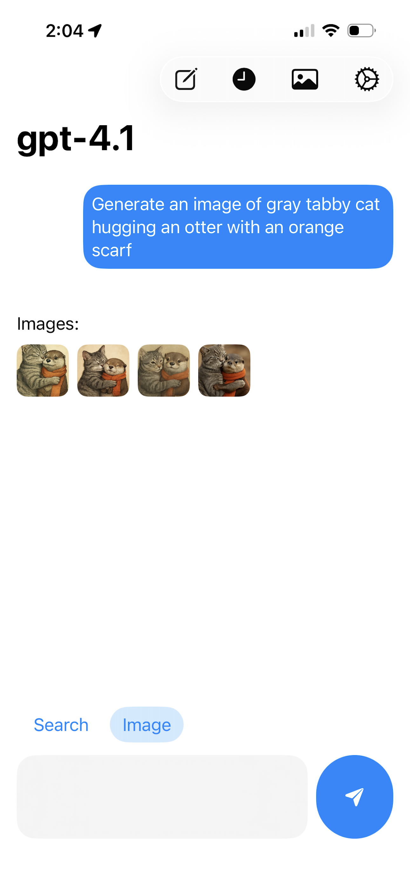
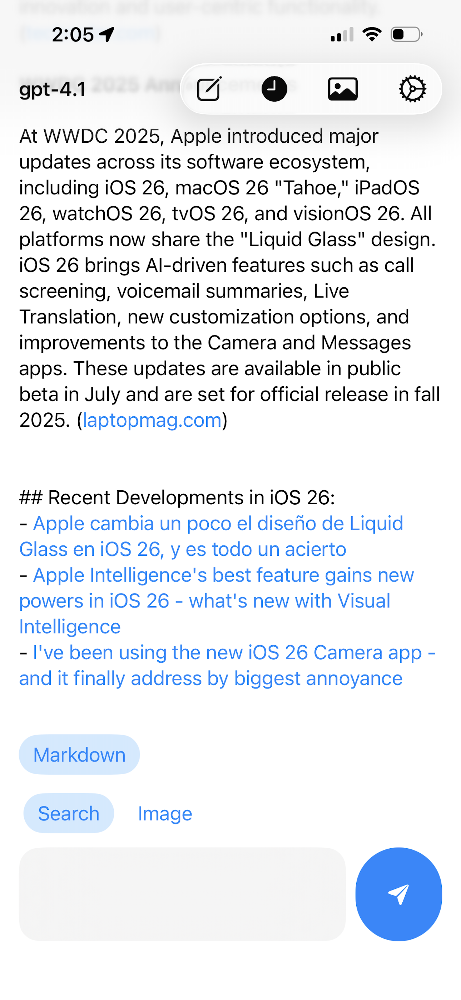
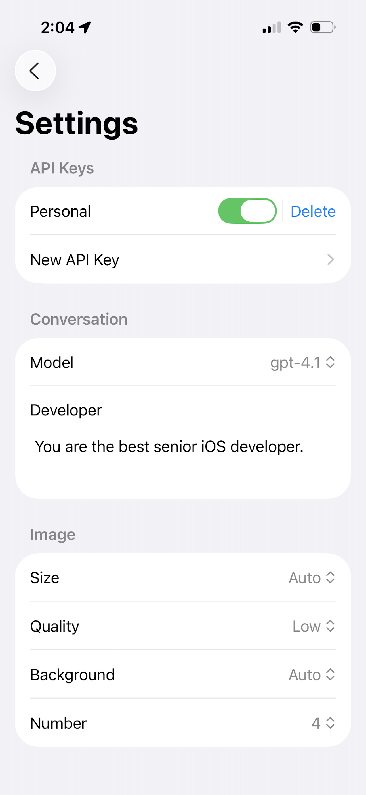

# PromptBuddy

## 📱 Download on the App Store

**PromptBuddy** is a lightweight, open-source ChatGPT client designed for speed, privacy, and flexibility. Use your own OpenAI API key to chat with GPT models and generate or modify images — all without login or hidden charges.

Originally built as a personal development tool, **PromptBuddy** is now available to everyone on **iOS**, **macOS**, and **visionOS**. Whether you’re writing, brainstorming, coding, or just exploring AI, PromptBuddy gives you a clean, efficient interface with full control.

## Features

- ⚡️ Lightweight & fast ChatGPT interface  
- 🔑 Works with your OpenAI API key – no account required  
- 🎨 Image generation & editing with prompt-based control  
- 🗂 Conversation history with easy management  
- 🍎 Native support for iOS, macOS, and visionOS  
- 💻 100% open source 

## 📸 Screenshots

### 📱 iOS

### 💻 macOS

### 🥽 visionOS

